# 🏗️ UML - Conception et Modélisation

> **UML** (Unified Modeling Language) : langage graphique standardisé pour modéliser les systèmes orientés objet.

---

## 📋 Table des Matières

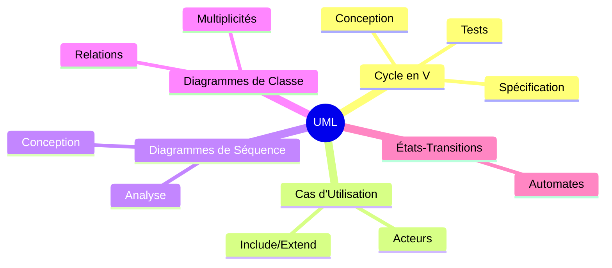

---

# 📐 PARTIE 1 — CYCLE DE DÉVELOPPEMENT (CYCLE EN V)

> Chaque phase de **conception** correspond à une phase de **validation**.

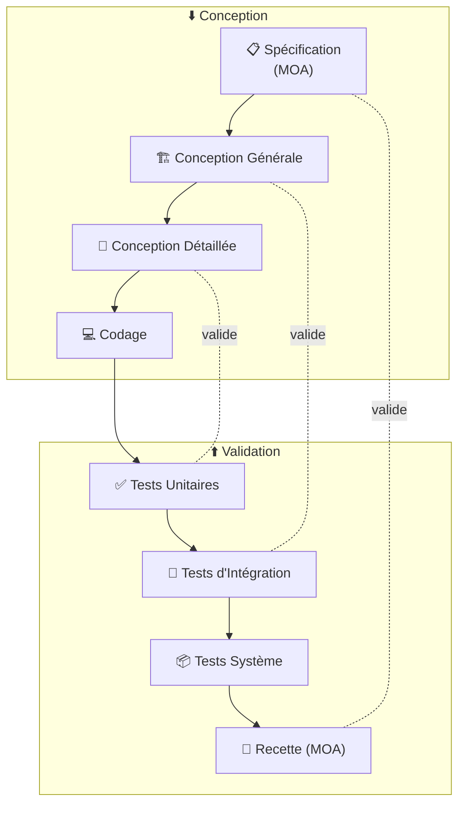

| Phase | Responsable | Validation par |
|-------|-------------|----------------|
| Spécification | MOA (Client) | Recette finale |
| Conception Générale | MOE (Équipe) | Tests d'intégration |
| Conception Détaillée | Développeur | Tests unitaires |

---

# 🎭 PARTIE 2 — DIAGRAMMES DE CAS D'UTILISATION

> Modélise **ce que fait** le système du point de vue de l'utilisateur.

## 2.1 Structure de Base

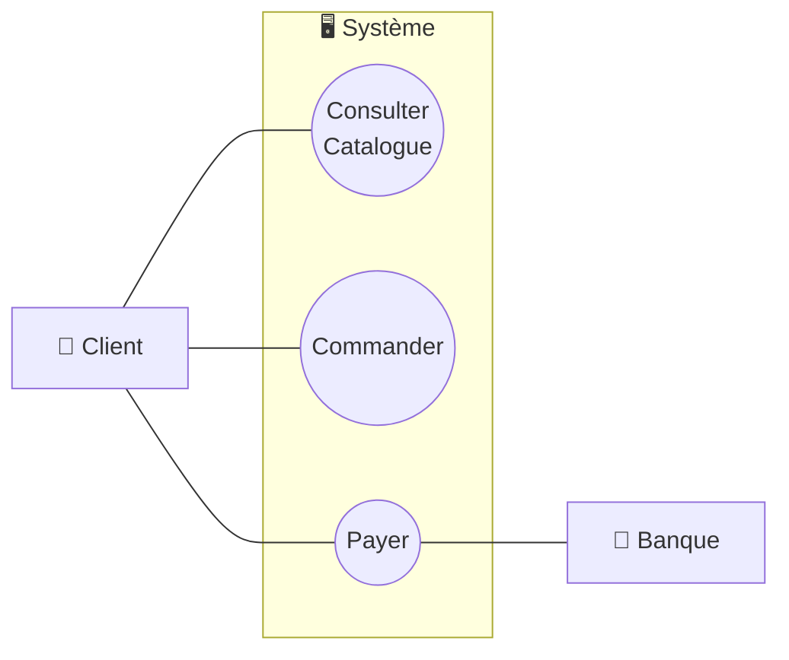

## 2.2 Relations entre Cas d'Utilisation

### 📊 Légende des Relations UML

| Relation | Notation | Signification |
|----------|----------|---------------|
| **Include** | `- - - ▷` pointillé | A **inclut obligatoirement** B |
| **Extend** | `- - - ▷` pointillé | A **peut étendre** B (optionnel) |
| **Généralisation** | `───▷` plein vide | A **est un type de** B |

### Include (Inclusion obligatoire)

> Le cas A **déclenche toujours** le cas B.

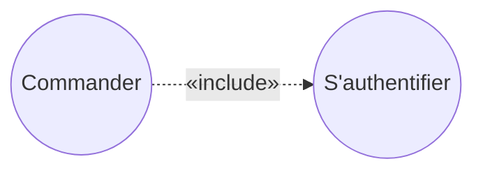

**Exemple** : *Commander* inclut obligatoirement *S'authentifier*.

### Extend (Extension optionnelle)

> Le cas A **peut optionnellement** déclencher B.

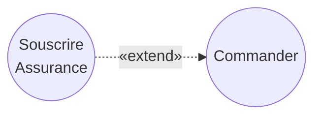

**Exemple** : *Souscrire une assurance* étend optionnellement *Commander*.

### Généralisation (Spécialisation)

> Le cas A **est une spécialisation** du cas B.

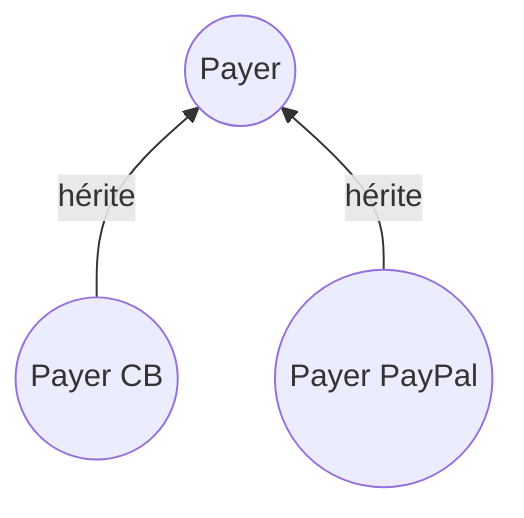

**Exemple** : *Payer CB* et *Payer PayPal* sont des types de *Payer*.

---

# ⏳ PARTIE 3 — DIAGRAMMES DE SÉQUENCE

> Représente les **interactions chronologiques** entre objets/acteurs.

## 3.1 Éléments Graphiques

| Élément | Représentation | Description |
|---------|----------------|-------------|
| **Acteur** | 🧑 Bonhomme | Entité externe au système |
| **Objet** | 📦 Rectangle | Instance d'une classe |
| **Ligne de vie** | `┆` pointillé vertical | Durée de vie de l'objet |
| **Message synchrone** | `───▶` plein | Appel bloquant (attend réponse) |
| **Message retour** | `- - -▶` pointillé | Réponse à un appel |
| **Message asynchrone** | `───>` flèche ouverte | Appel non bloquant |

## 3.2 Niveau Analyse (Vue simplifiée)

> Vision "boîte noire" du système.

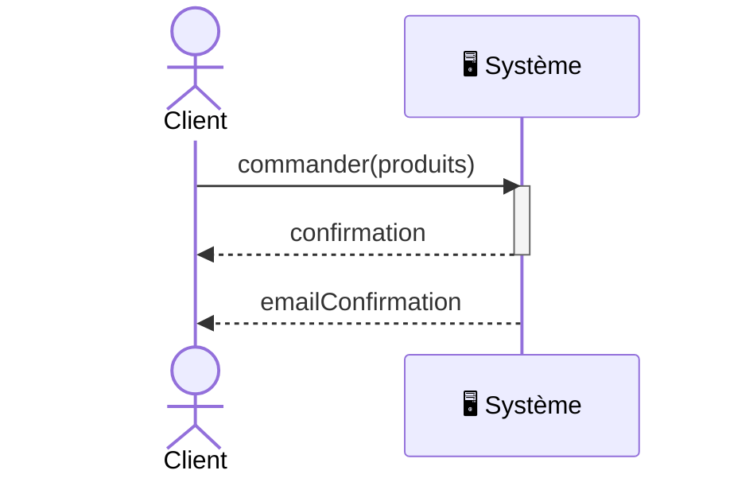

## 3.3 Niveau Conception (Vue détaillée)

> Interactions entre objets internes.

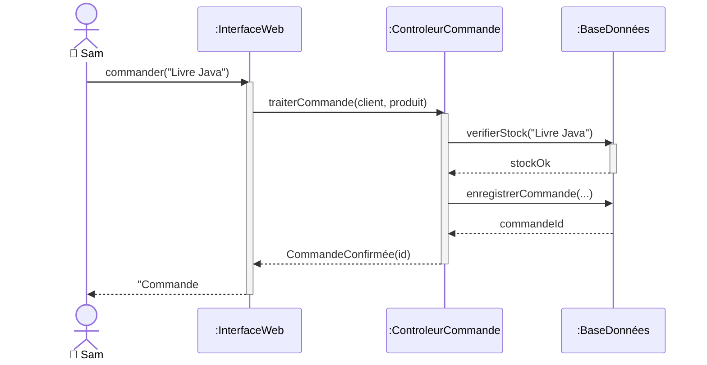

## 3.4 Fragments Combinés

| Fragment | Usage |
|----------|-------|
| `alt` | Alternative (if/else) |
| `opt` | Optionnel (if sans else) |
| `loop` | Boucle |
| `par` | Parallèle |
| `break` | Sortie anticipée |

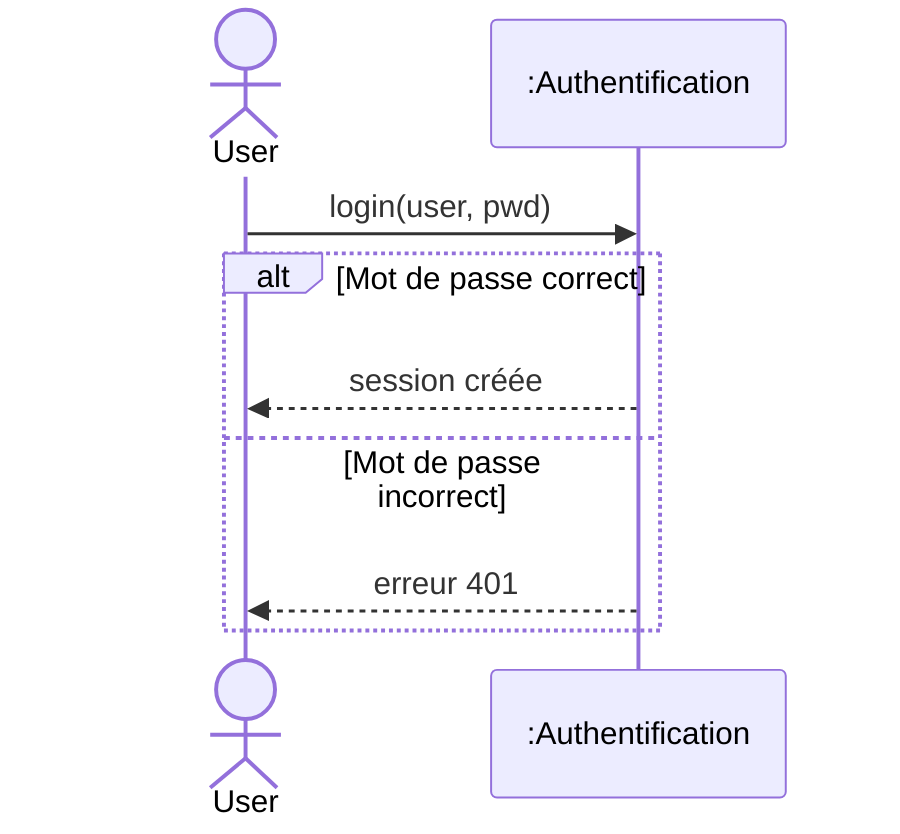


---

# ⛓️ PARTIE 4 — DIAGRAMMES DE CLASSE

> Modélise la **structure statique** : classes, attributs, méthodes et relations.

## 4.1 Structure d'une Classe

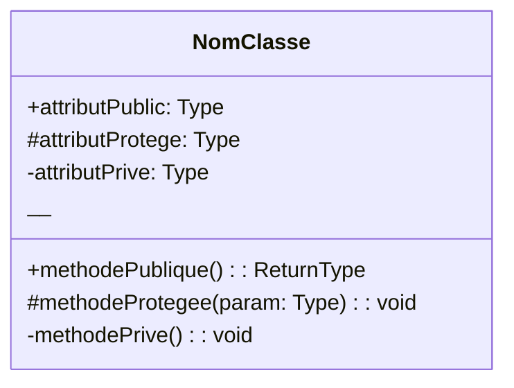

### Symboles de Visibilité

| Symbole | Visibilité | Java |
|:-------:|------------|------|
| `+` | Public | `public` |
| `#` | Protégé | `protected` |
| `-` | Privé | `private` |
| `~` | Package | *(défaut)* |

## 4.2 Relations UML — Légende Complète

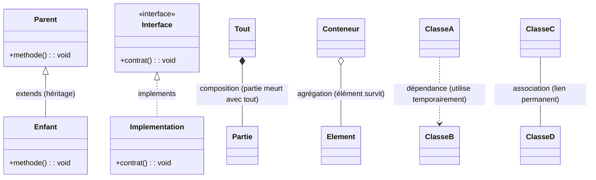

### Exemples concrets pour chaque relation

| Relation | Exemple concret | Explication |
|----------|-----------------|-------------|
| **Héritage** | `Animal <\|-- Chien` | Un Chien **est un** Animal |
| **Implémentation** | `Comparable <\|.. Produit` | Produit **implémente** l'interface Comparable |
| **Composition** | `Maison *-- Piece` | Une Pièce n'existe pas sans sa Maison |
| **Agrégation** | `Equipe o-- Joueur` | Un Joueur peut exister sans son Équipe |
| **Dépendance** | `Commande ..> Paiement` | Commande utilise Paiement temporairement (en paramètre) |
| **Association** | `Etudiant -- Universite` | Lien permanent entre Etudiant et Université |

### 🔑 Mémo Visuel Rapide

| Ce que vous voyez | Ce que ça signifie | Mot-clé Java |
|-------------------|-------------------|--------------|
| `───▷` trait **plein** + triangle **vide** | **Héritage** | `extends` |
| `- - -▷` trait **pointillé** + triangle **vide** | **Implémentation** | `implements` |
| `◆───` losange **plein** | **Composition** | (contient, cycle de vie lié) |
| `◇───` losange **vide** | **Agrégation** | (contient, cycle de vie indépendant) |
| `- - -▶` trait **pointillé** + flèche | **Dépendance** | (paramètre, variable locale) |
| `───▶` trait **plein** + flèche | **Association dirigée** | (attribut) |

### 🎯 Astuce pour retenir

- **Triangle** = relation de type/sous-type (héritage ou implémentation)
  - Plein = `extends` (classe concrète)
  - Pointillé = `implements` (interface)
- **Losange** = relation tout/partie
  - Plein ◆ = fort (composition)
  - Vide ◇ = faible (agrégation)

### 📊 Tableau des Relations (Normes UML)

| Relation | Flèche UML | Trait | Extrémité | Mermaid |
|----------|------------|-------|-----------|---------|
| **Association** | `───────` | Plein | Aucune | `--` |
| **Association dirigée** | `───────▶` | Plein | Flèche pleine | `-->` |
| **Dépendance** | `- - - - -▶` | Pointillé | Flèche pleine | `..>` |
| **Héritage** | `───────▷` | Plein | Triangle vide | `--|>` |
| **Implémentation** | `- - - - -▷` | Pointillé | Triangle vide | `..|>` |
| **Agrégation** | `◇───────` | Plein | Losange vide | `o--` |
| **Composition** | `◆───────` | Plein | Losange plein | `*--` |

## 4.3 Héritage (extends) — Triangle Vide + Trait Plein

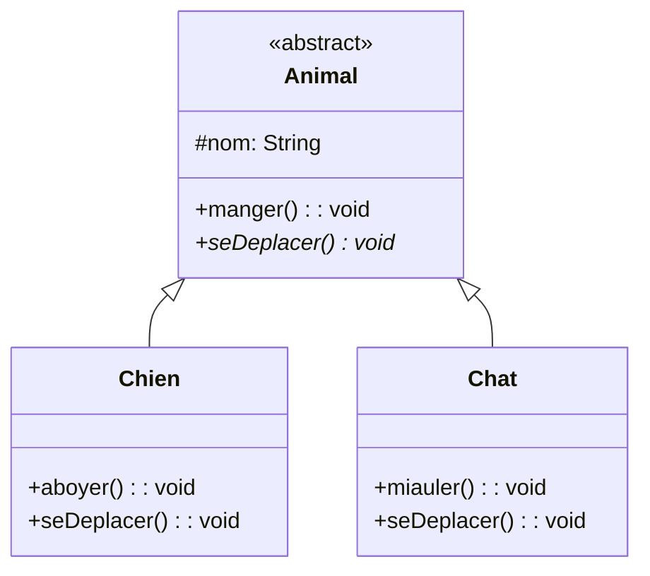

> ⚠️ **Norme UML** : Triangle **vide** (non rempli) + trait **plein**

## 4.4 Implémentation (implements) — Triangle Vide + Trait Pointillé

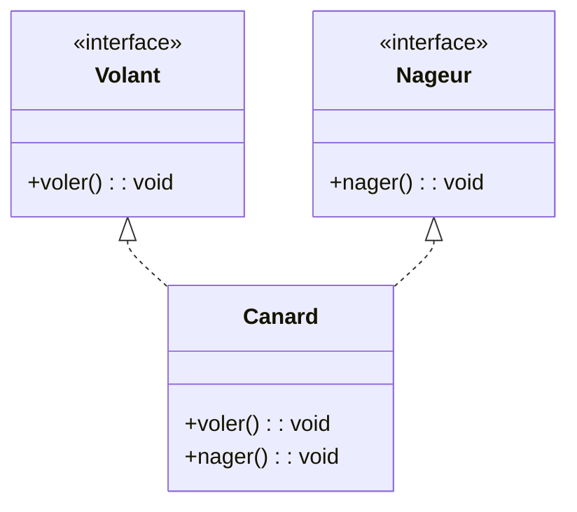

> ⚠️ **Norme UML** : Triangle **vide** + trait **pointillé**

## 4.5 Composition ◆ vs Agrégation ◇

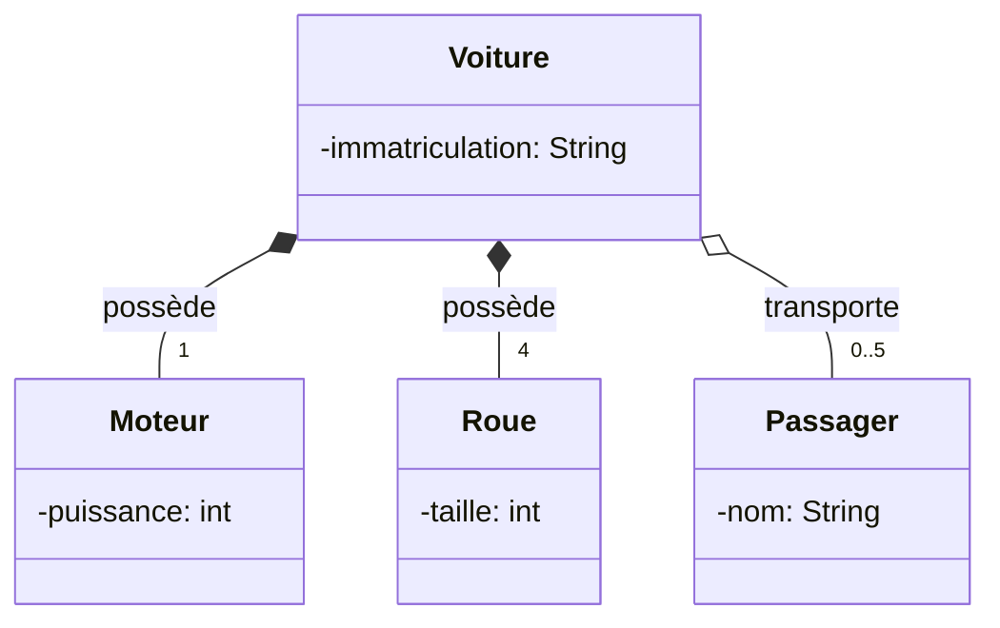

| | Composition ◆ | Agrégation ◇ |
|--|---------------|--------------|
| **Symbole** | Losange **plein** | Losange **vide** |
| **Cycle de vie** | Partie **meurt** avec le tout | Partie **survit** sans le tout |
| **Exemple** | Voiture ◆── Moteur | Voiture ◇── Passager |

## 4.6 Multiplicités

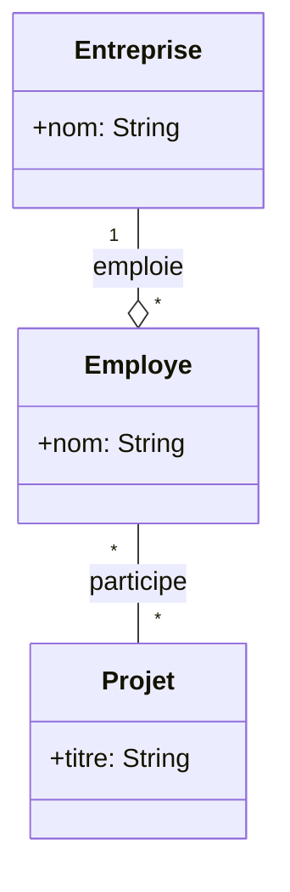

| Notation | Signification |
|----------|---------------|
| `1` | Exactement un |
| `0..1` | Zéro ou un (optionnel) |
| `*` ou `0..*` | Zéro ou plusieurs |
| `1..*` | Au moins un |
| `n..m` | Entre n et m |

## 4.7 Classe d'Association

> Quand une **relation** porte ses propres **attributs**.

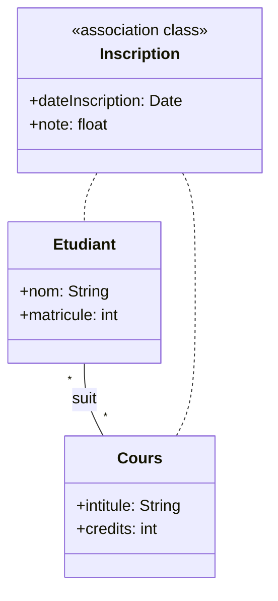

## 4.8 Exemple Complet

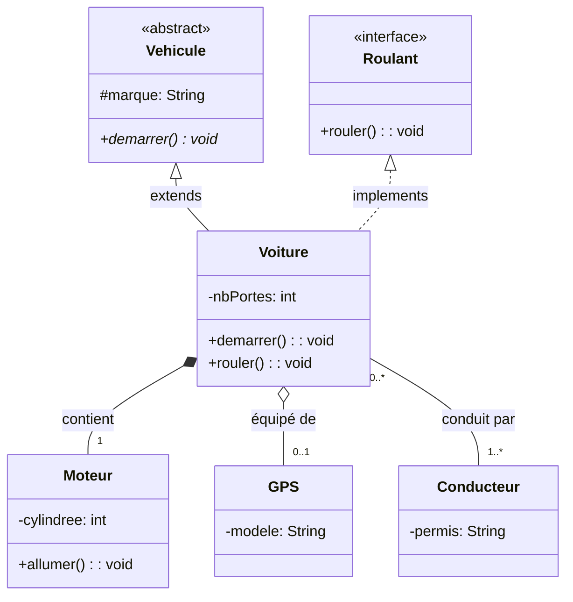

---

# 🔄 PARTIE 5 — DIAGRAMMES D'ÉTATS-TRANSITIONS

> Décrit le **comportement dynamique** d'un seul objet (automate).

## 5.1 Éléments Graphiques

| Élément | Symbole | Description |
|---------|:-------:|-------------|
| État initial | ● | Cercle noir plein |
| État | ⬜ arrondi | Rectangle aux coins arrondis |
| État final | ◉ | Cercle dans cercle |
| Transition | `───▶` | Flèche avec label |

## 5.2 Syntaxe des Transitions

```
événement [garde] / action
```

| Composant | Obligatoire | Description |
|-----------|:-----------:|-------------|
| Événement | ✅ | Ce qui déclenche la transition |
| Garde | ❌ | Condition entre `[crochets]` |
| Action | ❌ | Comportement après `/` |

## 5.3 Exemple : Distributeur Automatique (GAB)

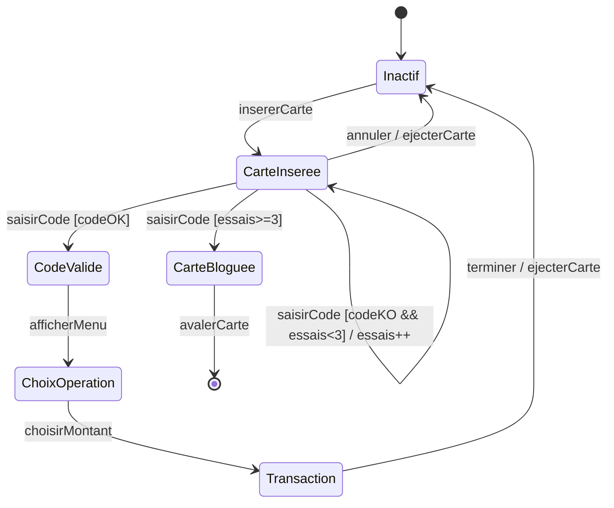

## 5.4 Actions Internes

| Mot-clé | Déclencheur | Exemple |
|---------|-------------|---------|
| `entry/` | À l'entrée dans l'état | `entry / nbEssais = 0` |
| `exit/` | À la sortie de l'état | `exit / sauvegarder()` |
| `do/` | Pendant tout l'état | `do / clignoter()` |

---

# 📋 RÉCAPITULATIF — NORMES UML

## Flèches des Diagrammes de Classe

| Relation | Trait | Extrémité côté cible | Mermaid |
|----------|:-----:|:--------------------:|:-------:|
| Héritage | ─── plein | ▷ triangle vide | `<\|--` |
| Implémentation | - - - pointillé | ▷ triangle vide | `<\|..` |
| Composition | ─── plein | ◆ losange plein (côté conteneur) | `*--` |
| Agrégation | ─── plein | ◇ losange vide (côté conteneur) | `o--` |
| Dépendance | - - - pointillé | ▶ flèche pleine | `..>` |
| Association dirigée | ─── plein | ▶ flèche pleine | `-->` |

## Vue d'Ensemble des Diagrammes

| Diagramme | Type de vue | Question |
|-----------|-------------|----------|
| Cas d'utilisation | Fonctionnelle | *Que fait le système ?* |
| Séquence | Dynamique | *Comment interagissent-ils ?* |
| Classe | Structurelle | *Comment est-ce organisé ?* |
| États-transitions | Comportementale | *Comment évolue l'objet ?* |

---

> **💡 Conseil** : En UML, chaque détail de flèche a un sens précis. Respectez les conventions pour une communication claire avec votre équipe !
