# ☕ Java & Programmation Orientée Objet (POO)

> **Guide complet** couvrant les fondamentaux de la POO, de la syntaxe de base jusqu'aux Design Patterns.

---

## 📋 Table des Matières

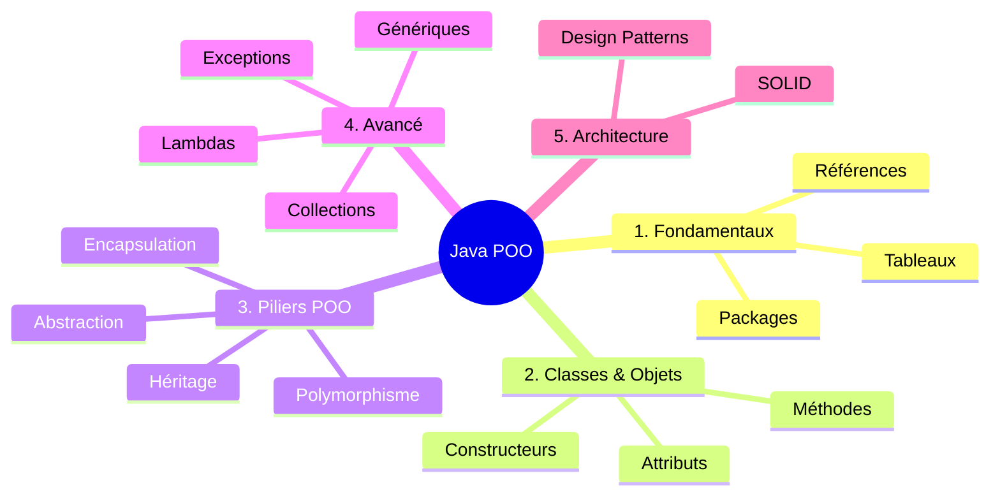

---

# 📦 PARTIE 1 — STRUCTURES DE DONNÉES DE BASE

## 🧺 1.1 Les Tableaux

> Un tableau est une **référence** vers une zone mémoire contiguë d'éléments du même type.

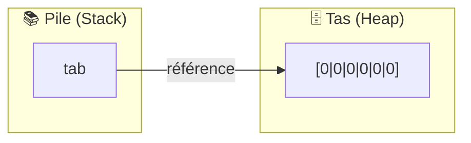

### ✅ Avantages Java vs C

| Aspect | C | Java |
|--------|---|------|
| Vérification des bornes | ❌ Corruption mémoire | ✅ `ArrayIndexOutOfBoundsException` |
| Taille | Calcul manuel | `.length` intégré |
| Initialisation | Valeurs aléatoires | Valeurs par défaut (0, null...) |

### 📝 Syntaxe

```java
// 1️⃣ Déclaration seule
int[] tab;

// 2️⃣ Allocation (6 entiers initialisés à 0)
tab = new int[6];

// 3️⃣ Tout-en-un avec valeurs
int[] tab2 = {1, 2, 3};
```

---

## 🏗️ 1.2 Objets et Classes

> Une **classe** est un moule (type complexe) ; un **objet** est une instance concrète de ce moule.

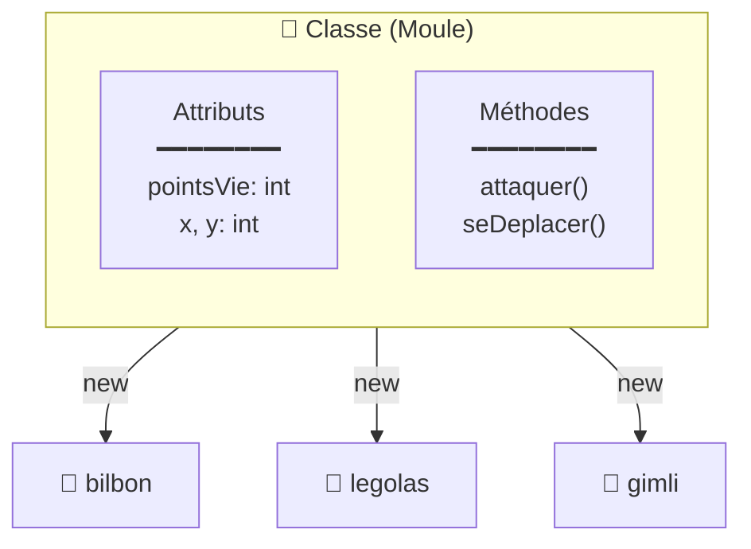

### 📝 Définition et Utilisation

```java
// 📐 Définition du moule
class Perso {
    int pointsVie;    // Attribut
    int x, y;         // Position
}

// 🎮 Création d'instances
Perso bilbon = new Perso();   // Allocation mémoire
bilbon.pointsVie = 10;        // Accès via "."
```

### ✅ Classe vs Tableau

| Critère | Tableau | Objet (Classe) |
|---------|---------|----------------|
| Types des éléments | Homogènes | Hétérogènes |
| Accès | Par indice `[i]` | Par nom `.attribut` |
| Sémantique | Numérique | Explicite |

---

## 🔗 1.3 La Réalité des Références

> En Java, **toute variable objet est une référence** (adresse mémoire), jamais l'objet lui-même.

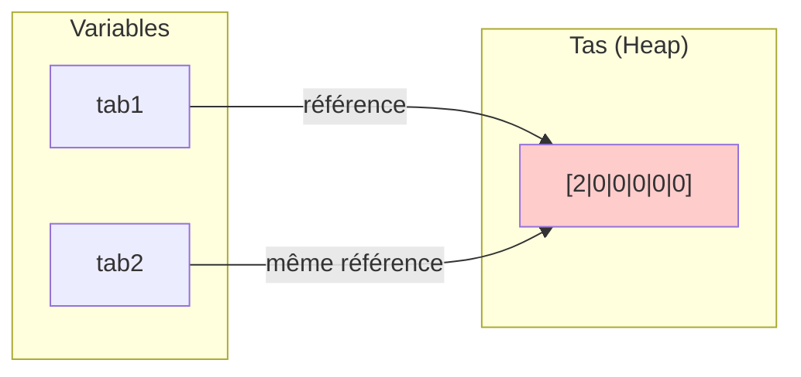

### ⚠️ L'Aliasing (Piège classique)

```java
byte[] tab1 = new byte[6];
byte[] tab2 = tab1;    // ⚠️ Même référence !

tab2[0] = 2;           // Modifie AUSSI tab1[0]
// tab1[0] == 2  ✓
```

### 📌 Points clés

| Concept | Description |
|---------|-------------|
| **Légèreté** | Passer un objet = copier 8 octets (l'adresse) |
| **`null`** | Référence vers "rien" |
| **`==`** | Compare les adresses, pas le contenu |
| **`.equals()`** | Compare le contenu (si redéfini) |

---

## 📦 1.4 Les Packages

> Organisation hiérarchique des classes, similaire aux dossiers.

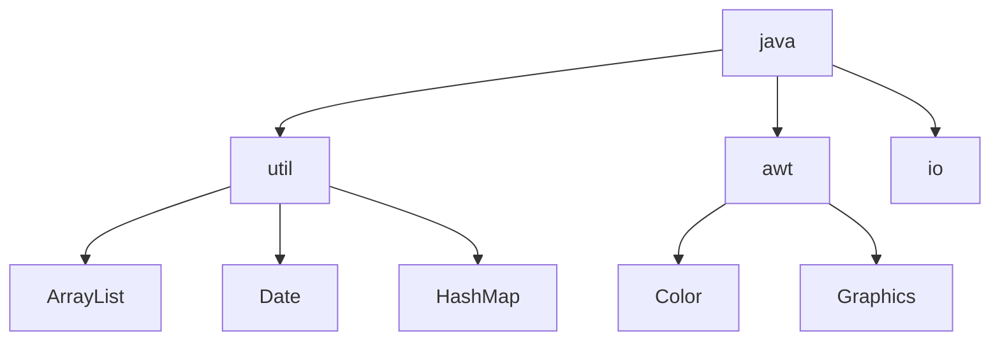

### 📝 Import et Déclaration

```java
import java.util.Date;     // Classe spécifique
import java.util.*;        // Tout le package

// Créer son propre package (correspond au dossier)
package ensiie.ipoo;
```

---

# 🛠️ PARTIE 2 — LES MÉTHODES

## 🏗️ 2.1 Méthodes de Classe (`static`)

> Méthodes appartenant à la **classe elle-même**, pas aux instances.

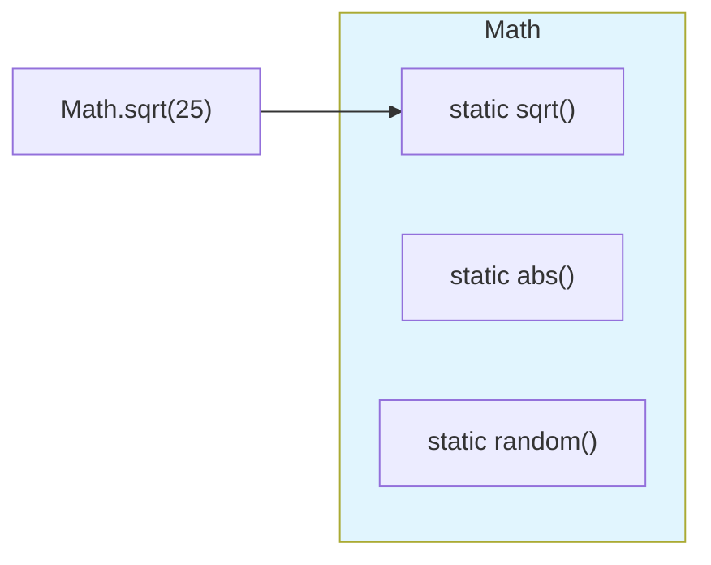

### 📝 Syntaxe

```java
public class Calcul {
    static int add(int x, int y) {  // ← static = classe
        return x + y;
    }
}

// Appel sans créer d'objet
int somme = Calcul.add(3, 5);
```

> 💡 **`main`** est une méthode static : point d'entrée sans instance.

---

## 🧬 2.2 La Surcharge (Overloading)

> Même nom de méthode, **signatures différentes**.

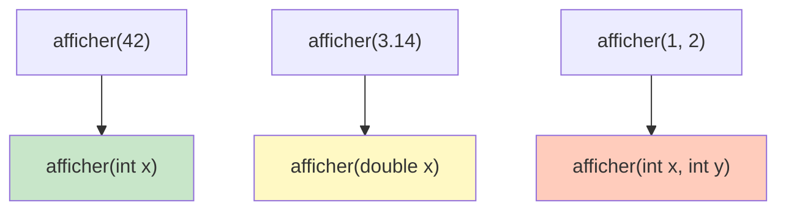

```java
static void afficher(int x)    { /* ... */ }
static void afficher(double x) { /* ... */ }
static void afficher(int x, int y) { /* ... */ }

afficher(42);    // → int
afficher(3.14);  // → double
```

---

## 🔄 2.3 Passage des Paramètres

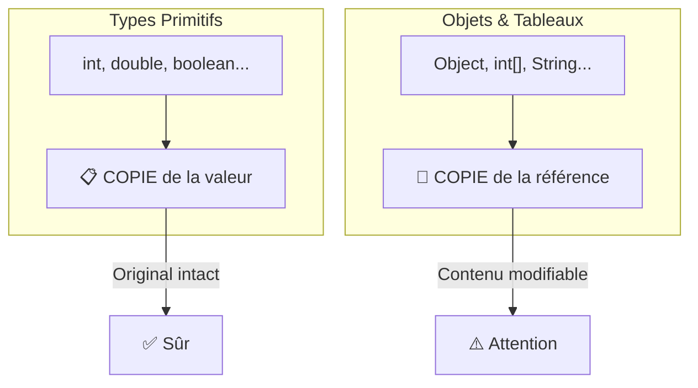

### 📊 Récapitulatif

| Type | Passage | Modification de l'original |
|------|---------|---------------------------|
| `int`, `double`, `boolean`... | Par **valeur** | ❌ Impossible |
| `Object`, tableaux | Par **référence** (copiée) | ✅ Contenu modifiable |

### ⚠️ Le Piège de la Réallocation

```java
void modifier(int[] t) {
    t[0] = 99;        // ✅ Modifie l'original
    t = new int[3];   // ❌ Perd le lien avec l'original
}
```

---

## 🧙 2.4 Méthodes d'Instance et `this`

> Méthodes liées à une **instance spécifique**.

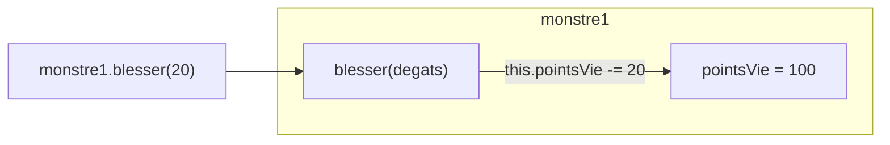

```java
class Monstre {
    int pointsVie;
    
    void blesser(int degats) {
        this.pointsVie -= degats;  // this = l'instance courante
    }
}

Monstre m = new Monstre();
m.blesser(20);  // Appel sur l'instance m
```

---

## 🏗️ 2.5 Le Constructeur

> Méthode spéciale appelée automatiquement lors du `new`.

### 📋 Règles

| Règle | Exemple |
|-------|---------|
| Même nom que la classe | `class Perso { Perso() {...} }` |
| Pas de type de retour | `Perso()` et non `void Perso()` |
| Constructeur par défaut | Créé si aucun n'est défini |

```java
class Perso {
    int pv;
    String nom;
    
    // Constructeur personnalisé
    Perso(String nom, int pv) {
        this.nom = nom;
        this.pv = pv;
    }
}

Perso hero = new Perso("Bilbon", 100);
```

---

## 🛡️ 2.6 Encapsulation et Visibilité

> **Cacher les détails** pour ne montrer que l'essentiel.

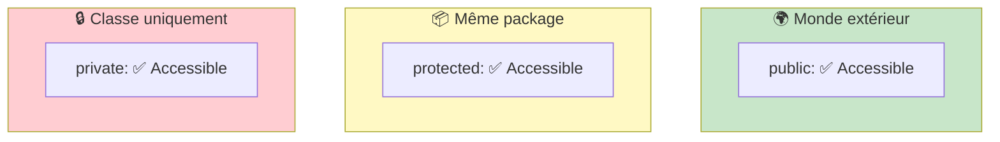

### 📊 Tableau de Visibilité

| Modificateur | Classe | Package | Sous-classe | Monde |
|--------------|:------:|:-------:|:-----------:|:-----:|
| `public` | ✅ | ✅ | ✅ | ✅ |
| `protected` | ✅ | ✅ | ✅ | ❌ |
| *(défaut)* | ✅ | ✅ | ❌ | ❌ |
| `private` | ✅ | ❌ | ❌ | ❌ |

### 💡 Pattern Getter/Setter

```java
class Compte {
    private double solde;  // 🔒 Caché
    
    public double getSolde() {           // 📖 Lecture
        return solde;
    }
    
    public void deposer(double montant) { // ✏️ Écriture contrôlée
        if (montant > 0) solde += montant;
    }
}
```

---

# 🧬 PARTIE 3 — HÉRITAGE, POLYMORPHISME & ABSTRACTION

## 🔝 3.1 Les Bases de l'Héritage

> Une classe **fille** hérite automatiquement des attributs et méthodes de sa classe **mère**.

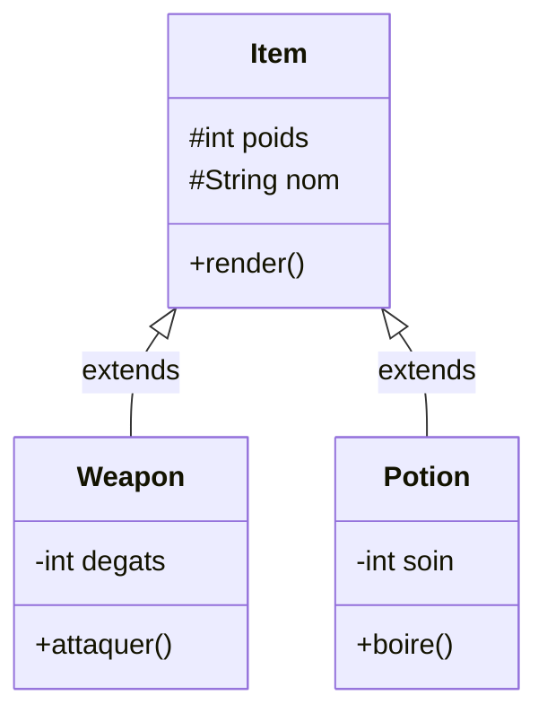

### 📝 Syntaxe

```java
class Item {
    protected int poids;
    public void render() { /* ... */ }
}

class Weapon extends Item {  // ← Hérite de Item
    private int degats;
    public void attaquer() { /* ... */ }
}
```

### ✅ Avantages

| Avantage | Description |
|----------|-------------|
| **Réutilisabilité** | Code commun factorisé dans la mère |
| **Hiérarchie** | Relation "est un" (Sword *est un* Item) |
| **Extensibilité** | Ajouter des spécialisations facilement |

---

## 🛠️ 3.2 `super` et Casting

### Le mot-clé `super`

> Appeler explicitement le constructeur ou une méthode de la classe mère.

```java
class Weapon extends Item {
    private int degats;
    
    Weapon(String nom, int poids, int degats) {
        super(nom, poids);      // ← Appelle Item(nom, poids)
        this.degats = degats;
    }
    
    @Override
    public void render() {
        super.render();         // ← Appelle Item.render()
        // + code spécifique
    }
}
```

### Transtypage (Casting)

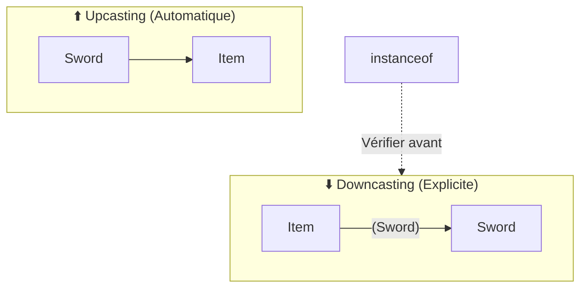

```java
Item item = new Sword();           // ✅ Upcasting automatique

Sword s = (Sword) item;            // ⚠️ Downcasting explicite

// Sécurité avec instanceof
if (item instanceof Sword) {
    Sword s = (Sword) item;        // ✅ Sûr
}
```

---

## 🎭 3.3 Polymorphisme et Redéfinition

> Java appelle la méthode de la **classe réelle** de l'objet, pas celle de la variable.

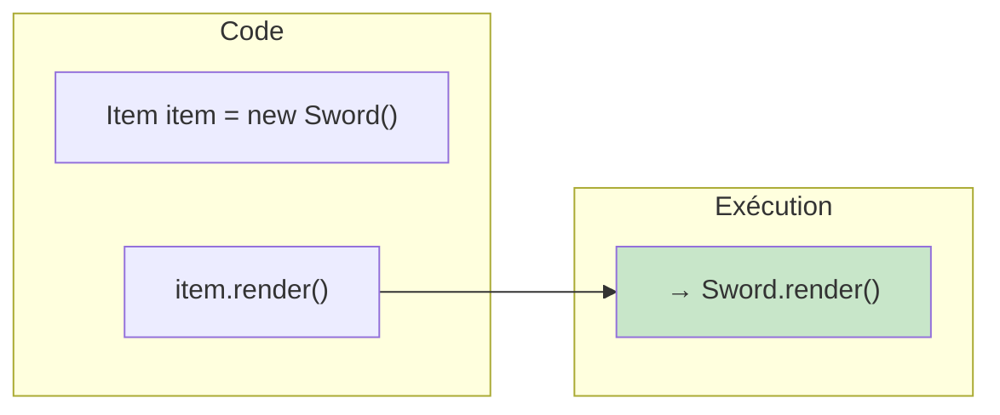

### `@Override` - La Redéfinition

```java
class Item {
    public void render() {
        System.out.println("Item générique");
    }
}

class Sword extends Item {
    @Override                    // ← Annotation de sécurité
    public void render() {
        System.out.println("⚔️ Épée brillante");
    }
}

// Polymorphisme en action
Item[] sac = { new Sword(), new Potion() };
for (Item i : sac) {
    i.render();  // Chaque objet utilise SA méthode
}
```

---

## 🔒 3.4 Contrôle de l'Héritage

| Modificateur | Effet |
|--------------|-------|
| `final` (classe) | 🚫 Pas de classes filles |
| `final` (méthode) | 🚫 Pas de redéfinition |
| `protected` | ✅ Visible pour les filles et le package |

```java
final class String { ... }           // Impossible d'hériter

class Item {
    final void render() { ... }      // Impossible de redéfinir
}
```

---

## ☁️ 3.5 Abstraction et Interfaces

### Classes Abstraites

> Une classe `abstract` ne peut **pas être instanciée** — c'est un modèle incomplet.

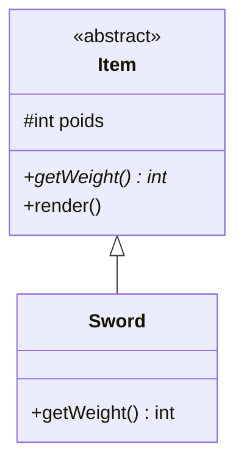

```java
abstract class Item {
    protected int poids;
    
    abstract int getWeight();  // ← Doit être implémentée
    
    void render() { /* code commun */ }
}
```

### Interfaces

> Contrat pur : que des **signatures** de méthodes.

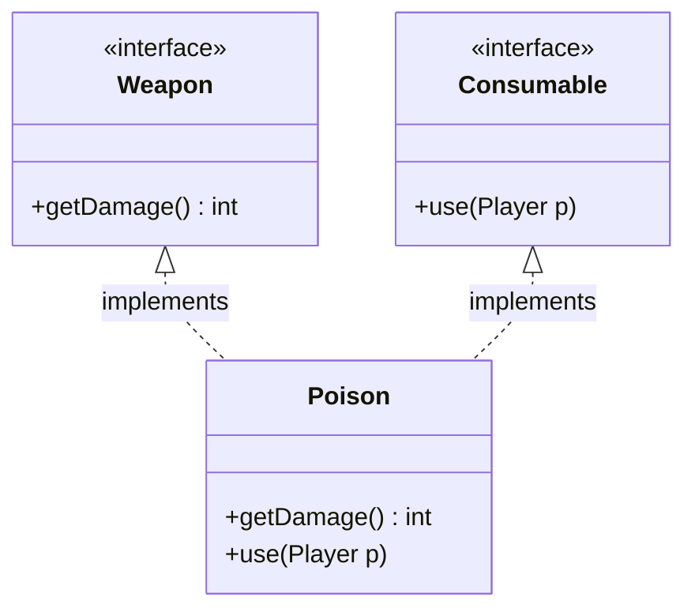

```java
interface Weapon {
    int getDamage();
}

interface Consumable {
    void use(Player p);
}

// Héritage multiple via interfaces !
class Poison implements Weapon, Consumable {
    public int getDamage() { return 50; }
    public void use(Player p) { p.empoisonner(); }
}
```

### 📊 Comparatif

| | Classe Abstraite | Interface |
|--|-----------------|-----------|
| Attributs | ✅ Oui | ❌ Non (sauf constantes) |
| Constructeur | ✅ Oui | ❌ Non |
| Héritage multiple | ❌ Non | ✅ Oui |
| Méthodes concrètes | ✅ Oui | ✅ (depuis Java 8 : `default`) | 

---

# ⚠️ PARTIE 4 — GESTION DES EXCEPTIONS

> Les exceptions permettent de gérer les erreurs **proprement**, sans polluer le code avec des `if/else`.

## 💡 4.1 Concept

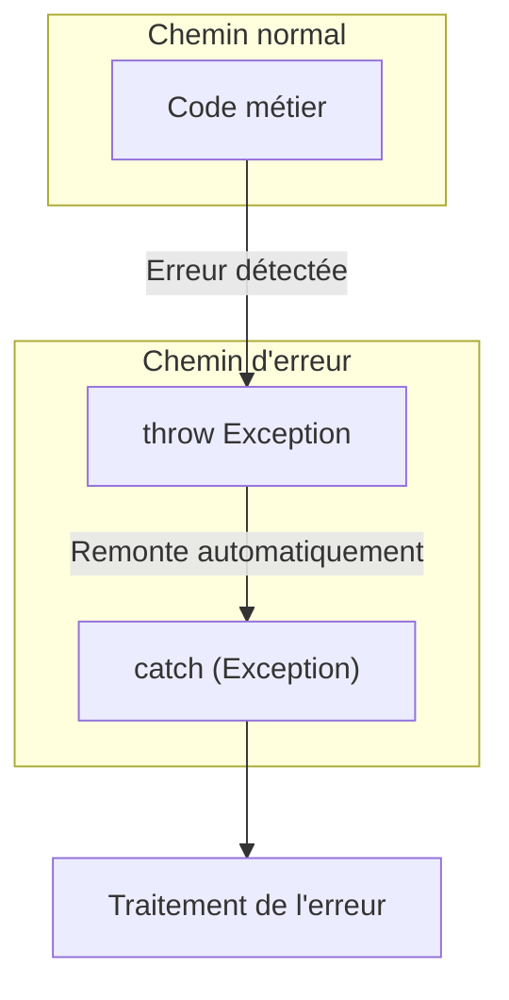

## 🏗️ 4.2 Lever et Déclarer

### `throw` vs `throws`

| Mot-clé | Rôle | Exemple |
|---------|------|---------|
| `throw` | **Lancer** une exception | `throw new Exception("erreur");` |
| `throws` | **Déclarer** qu'une méthode peut échouer | `void f() throws Exception` |

### Créer une Exception Personnalisée

```java
class NegativeValue extends Exception {
    public NegativeValue(String msg) {
        super(msg);
    }
}

// Utilisation
double log(double x) throws NegativeValue {
    if (x < 0) throw new NegativeValue("x doit être positif");
    return Math.log(x);
}
```

---

## 🛡️ 4.3 Intercepter : `try / catch / finally`

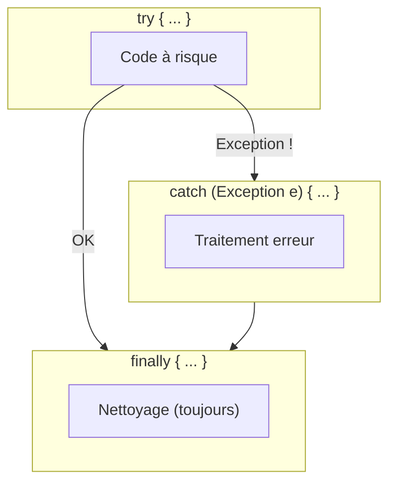

```java
try {
    double res = log(-5);
} catch (NegativeValue e) {
    System.out.println("Erreur : " + e.getMessage());
} finally {
    System.out.println("Fin du traitement");  // Toujours exécuté
}
```

---

## 🚩 4.4 Exceptions Prédéfinies

| Exception | Cause |
|-----------|-------|
| `NullPointerException` | Accès à une référence `null` |
| `ArrayIndexOutOfBoundsException` | Indice hors tableau |
| `IllegalArgumentException` | Argument invalide |
| `ClassCastException` | Mauvais cast |
| `NumberFormatException` | Conversion texte → nombre échouée |

### Checked vs Unchecked

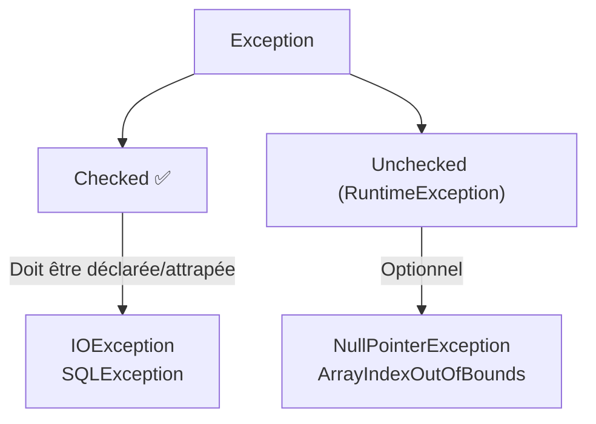


---

# 🧬 PARTIE 5 — CLASSES GÉNÉRIQUES

> Écrire du code **réutilisable** et **type-safe** pour n'importe quel type.

## 🛠️ 5.1 Le Problème sans Génériques

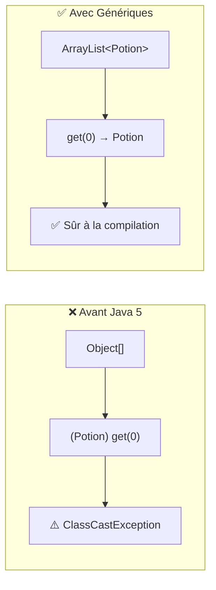

## 🏗️ 5.2 Syntaxe de Base

```java
// Définition d'une classe générique
class Bag<E> {                    // E = Type paramètre
    private E[] elements;
    
    public E get(int i) {
        return elements[i];       // Retourne le bon type
    }
    
    public void add(E element) {
        // ...
    }
}

// Utilisation avec opérateur diamant <>
Bag<Potion> sacPotions = new Bag<>();   // Inférence de type
sacPotions.add(new Potion());           // ✅ OK
sacPotions.add(new Sword());            // ❌ Erreur compilation
```

## 🎓 5.3 Notions Avancées

### Contraintes avec `extends`

```java
// E doit être un Item ou une sous-classe
class Bag<E extends Item> {
    public int getPoidsTotal() {
        int total = 0;
        for (E e : elements) {
            total += e.getWeight();  // ✅ Méthode de Item garantie
        }
        return total;
    }
}
```

### Multi-paramètres

```java
class Tree<K, V> {      // K = Key, V = Value
    private K cle;
    private V valeur;
}

Tree<String, Integer> ages = new Tree<>();
```

### ⚠️ Piège des Tableaux Génériques

```java
// ❌ INTERDIT
Bag<String>[] sacs = new Bag<String>[10];

// ✅ AUTORISÉ (cast brut)
Bag<String>[] sacs = new Bag[10];
```

## 📋 Récapitulatif

| Concept | Syntaxe | Usage |
|---------|---------|-------|
| Classe paramétrée | `class Nom<T>` | Modèle flexible |
| Multi-paramètres | `class Map<K, V>` | Dictionnaires |
| Contrainte | `<E extends Type>` | Limiter les types acceptés |
| Inférence (diamant) | `new Nom<>()` | Simplifier l'écriture |


C'est un plaisir de poursuivre ce cours ! Nous arrivons maintenant à l'une des parties les plus utiles au quotidien pour un développeur Java : **la bibliothèque des Collections**.

Plutôt que de réinventer la roue en créant vos propres structures à chaque fois, Java vous propose une boîte à outils standardisée, performante et générique via le package `java.util`.

---

# 📚 Java - Les Collections (`java.util`)

## 🛠️ SECTION 1 - LES FONDAMENTAUX DE LA COMPARAISON

Avant de stocker des objets, Java doit savoir comment les comparer. Trois méthodes héritées de la classe `Object` ou d'interfaces de base sont essentielles :

* **`equals(Object o)`** : Utilisée pour vérifier si deux objets ont la même valeur.


* **`hashCode()`** : Fournit un identifiant numérique (hachage) pour un objet, crucial pour les performances des tables de hachage.


* **`compareTo(T o)`** (Interface `Comparable`) : Permet de définir un ordre naturel (savoir si un objet est "plus petit" qu'un autre).

## 🧺 SECTION 2 - LA FAMILLE `Collection<E>`

L'interface `Collection<E>` est la racine des structures stockant des éléments simples.

### 1. L'interface `List<E>` (Listes ordonnées)

**Description** : Une liste est une généralisation des tableaux où chaque élément possède un indice.

**Points positifs** : Les doublons sont autorisés et l'ordre d'insertion est préservé.

**Implémentations** :
* **`ArrayList<E>`** : Basée sur un tableau extensible. Accès aléatoire très rapide, mais l'ajout/suppression au milieu est lent.

* **`LinkedList<E>`** : Basée sur une liste chaînée. Ajout/suppression rapides, mais l'accès à un indice précis est lent.

**Quelques méthodes**:
* `void add(int i, E e)`
* `void set(int i, E e)`
* `E get(int i)`
* `E remove(int i)`

### 2. L'interface `Set<E>` (Ensembles)

**Description** : Un ensemble stocke des éléments uniques, sans notion d'indice.

**Points positifs** : Garantit l'absence de doublons.

**Implémentations** :
* **`HashSet<E>`** : Utilise une table de hachage. Très performant mais l'ordre n'est pas garanti.

* **`TreeSet<E>`** : Utilise un arbre binaire (Rouge-Noir). Les éléments sont automatiquement triés.

## 🔄 SECTION 3 - PARCOURIR UNE COLLECTION

Pour traiter chaque élément d'une collection, deux outils sont privilégiés:

### 1. L'Itérateur (`Iterator<E>`)

* **Description** : Un objet qui permet de naviguer dans la collection un élément à la fois.

* **Méthodes clés** : `hasNext()` (y a-t-il un suivant ?) et `next()` (donne le suivant et avance).

### 2. La boucle "For-Each"

**Description** : Un "sucre syntaxique" qui simplifie l'utilisation de l'itérateur.

**Exemple** :

```java
for (Monster m : col) {
    System.out.println(m.name); // Simple et lisible 
}
```

> 
> **Note** : Cette syntaxe fonctionne également pour les tableaux classiques.
> 
> 

## 🗺️ SECTION 4 - LES TABLES D'ASSOCIATION (`Map<K, V>`)

**Description** : Une `Map` n'est pas techniquement une `Collection`, car elle associe une **Clé** (`K`) à une **Valeur** (`V`).


**Fonctionnalités** :
* `put(key, value)` : Ajoute ou modifie une association.

* `get(key)` : Récupère la valeur associée à une clé.

* `boolean remove(K k)` : supprime l’association

**Implémentations** :
* **`HashMap<K, V>`** : Rapide, non triée.

* **`TreeMap<K, V>`** : Triée selon l'ordre des clés.

## 🎓 RÉCAPITULATIF DES CHOIX TECHNIQUES

| Besoin | Structure recommandée |
| --- | --- |
| **Accès rapide par indice** | <br>`ArrayList` 
| **Ajouts fréquents en milieu de liste** | <br>`LinkedList` 
| **Unicité des éléments (non triés)** | <br>`HashSet` 
| **Unicité + Tri automatique** | <br>`TreeSet` 
| **Dictionnaire (Clé -> Valeur)** | <br>`HashMap` ou `TreeMap` 

---

# 🎭 PARTIE 7 — CLASSES INTERNES, ANONYMES & LAMBDAS

## 📦 7.1 Classes Internes

> Classe définie **à l'intérieur** d'une autre classe.

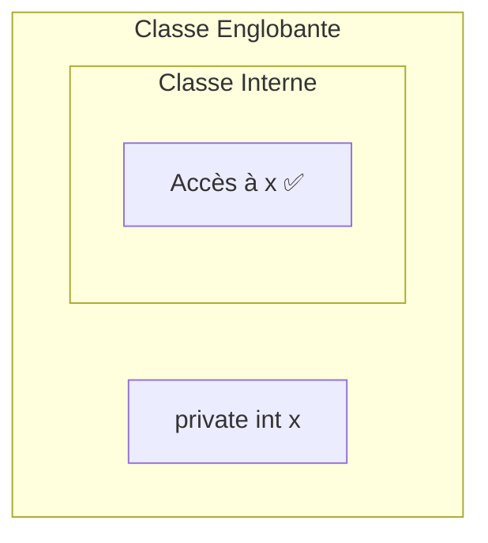

```java
class Liste {
    private Node head;
    
    // Classe interne : accès aux champs privés de Liste
    class Node {
        int data;
        Node next;
    }
}

// Instanciation
Liste liste = new Liste();
Liste.Node node = liste.new Node();
```

## 👤 7.2 Classes Anonymes

> Classe **sans nom**, définie et instanciée en une seule expression.

```java
// Avant : créer un fichier MonOiseau.java
// Après : tout en une ligne

Bird bird = new Bird() {
    @Override
    public void fly() {
        System.out.println("Je vole !");
    }
};
```

### Cas d'usage typique : Listeners

```java
button.addActionListener(new ActionListener() {
    @Override
    public void actionPerformed(ActionEvent e) {
        System.out.println("Cliqué !");
    }
});
```

## ⚡ 7.3 Expressions Lambda

> Syntaxe ultra-concise pour les **interfaces fonctionnelles** (1 seule méthode abstraite).

```mermaid
flowchart LR
    subgraph Avant["Classe Anonyme"]
        anon["new Comparator() {<br/>  int compare(a,b) {<br/>    return a - b;<br/>  }<br/>}"]
    end
    
    subgraph Apres["Lambda"]
        lambda["(a, b) -> a - b"]
    end
    
    Avant -->|"Simplification"| Apres
    
    style Apres fill:#c8e6c9
```

### Syntaxe

```java
// Forme complète
(int x, int y) -> { return x + y; }

// Forme simplifiée (1 expression)
(x, y) -> x + y

// Un seul paramètre
x -> x * 2

// Aucun paramètre
() -> System.out.println("Hello")
```

### Exemples d'utilisation

```java
// Parcours
liste.forEach(e -> System.out.println(e));

// Tri personnalisé
liste.sort((a, b) -> a.nom.compareTo(b.nom));

// Filtrage (Stream API)
liste.stream()
     .filter(p -> p.age > 18)
     .collect(Collectors.toList());
```

## 📊 Récapitulatif

| Type | Nommée | Accès externe | Usage |
|------|:------:|:-------------:|-------|
| Classe Interne | ✅ | Total | Couplage fort |
| Classe Anonyme | ❌ | Lecture seule | Usage unique |
| Lambda | ❌ | Lecture seule | Interface fonctionnelle |

---

# 🏗️ PARTIE 8 — DESIGN PATTERNS & PRINCIPES SOLID

> Solutions éprouvées pour un code **maintenable**, **extensible** et **réutilisable**.

## 📐 8.1 Cohésion et Couplage

```mermaid
flowchart LR
    subgraph Mauvais["❌ Fort Couplage"]
        A1["Classe A"] <-->|"dépend"| B1["Classe B"]
        B1 <-->|"dépend"| C1["Classe C"]
    end
    
    subgraph Bon["✅ Faible Couplage"]
        A2["Classe A"] --> I["Interface"]
        B2["Classe B"] --> I
        C2["Classe C"] --> I
    end
```

| Concept | Objectif | Définition |
|---------|:--------:|------------|
| **Cohésion** | 🔼 Forte | Une classe = une responsabilité |
| **Couplage** | 🔽 Faible | Minimiser les dépendances entre classes |

## 🧱 8.2 Principes S.O.L.I.D.

```mermaid
mindmap
  root((SOLID))
    S
      Single Responsibility
      1 classe = 1 raison de changer
    O
      Open/Closed
      Ouvert extension
      Fermé modification
    L
      Liskov Substitution
      Fille remplace Mère
    I
      Interface Segregation
      Petites interfaces spécifiques
    D
      Dependency Inversion
      Dépendre des abstractions
```

### Résumé

| Principe | Règle | Exemple |
|----------|-------|---------|
| **S** | 1 classe = 1 responsabilité | `UserValidator` ≠ `UserRepository` |
| **O** | Étendre sans modifier | Ajouter des sous-classes |
| **L** | Fille substituable à Mère | `List list = new ArrayList()` |
| **I** | Interfaces spécialisées | `Flyable`, `Swimmable` ≠ `Animal` |
| **D** | Dépendre des abstractions | `Service(IRepository repo)` |

## ♻️ 8.3 DRY (Don't Repeat Yourself)

> Chaque connaissance doit avoir une représentation **unique** dans le système.

```java
// ❌ MAUVAIS : Code dupliqué
void methodA() { /* 50 lignes */ validation(); calcul(); }
void methodB() { /* mêmes 50 lignes */ validation(); calcul(); }

// ✅ BON : Factoriser
void traitement() { validation(); calcul(); }
void methodA() { traitement(); }
void methodB() { traitement(); }
```

---

## 🎨 8.4 Design Patterns

### 🔒 Singleton (Création)

> **Garantir une instance unique** avec accès global.

```mermaid
classDiagram
    class Singleton {
        -static instance: Singleton
        -Singleton()
        +static getInstance(): Singleton
    }
```

```java
public class Singleton {
    private static Singleton instance;
    
    private Singleton() {}  // Constructeur privé
    
    public static synchronized Singleton getInstance() {
        if (instance == null) {
            instance = new Singleton();
        }
        return instance;
    }
}
```

### 🏭 Factory Method (Création)

> **Déléguer la création** à des sous-classes.

```mermaid
classDiagram
    class PizzaStore {
        <<abstract>>
        +orderPizza(type): Pizza
        #createPizza(type): Pizza*
    }
    
    class ParisPizzaStore {
        #createPizza(type): Pizza
    }
    
    class NYPizzaStore {
        #createPizza(type): Pizza
    }
    
    PizzaStore <|-- ParisPizzaStore
    PizzaStore <|-- NYPizzaStore
```

```java
public abstract class PizzaStore {
    public Pizza orderPizza(String type) {
        Pizza pizza = createPizza(type);  // Factory Method
        pizza.prepare();
        pizza.bake();
        return pizza;
    }
    
    protected abstract Pizza createPizza(String type);
}

public class ParisPizzaStore extends PizzaStore {
    @Override
    protected Pizza createPizza(String type) {
        if (type.equals("cheese")) return new ParisCheesePizza();
        if (type.equals("pepperoni")) return new ParisPepperoniPizza();
        return null;
    }
}
```

### ✅ Avantages

| Pattern | Problème résolu |
|---------|-----------------|
| Singleton | Ressource partagée unique (config, log) |
| Factory | Découplage création/utilisation |

---

# 📋 RÉCAPITULATIF GÉNÉRAL

```mermaid
flowchart TB
    subgraph Fondamentaux
        A[Tableaux & Références]
        B[Classes & Objets]
        C[Packages]
    end
    
    subgraph Méthodes
        D[static / instance]
        E[Constructeurs]
        F[Encapsulation]
    end
    
    subgraph POO
        G[Héritage]
        H[Polymorphisme]
        I[Abstraction]
    end
    
    subgraph Avancé
        J[Exceptions]
        K[Génériques]
        L[Collections]
        M[Lambdas]
    end
    
    subgraph Architecture
        N[SOLID]
        O[Design Patterns]
    end
    
    Fondamentaux --> Méthodes --> POO --> Avancé --> Architecture
```

---

> **💡 Conseil final** : La POO n'est pas qu'une syntaxe — c'est une **façon de penser**. Modélisez le monde réel en objets avec des responsabilités claires !